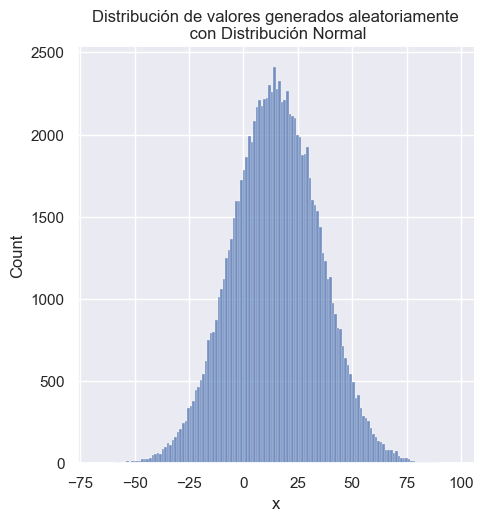

# Banco_Ejercicios_Matematicas

Este banco recolecta listas de ejercicios de matemáticas generados aleatoriamente bajo ciertas condiciones. La finalidad es que los ejercicios creados puedan ser utilizados para la enseñanza de las matemáticas como preparación para la PAA ([Prueba de Actitud Académica](https://latam.collegeboard.org/paa/)).

El banco posee las siguientes listas en formato TXT:
* Aritmética:
	* [Estadística](/Aritmética/Estadística/ejercicios.txt)
* Álgebra:
	* [Ecuaciones lineales](/Álgebra/Ecuaciones_lineales/ecuaciones.txt)
		* [Respuestas](/Álgebra/Ecuaciones_lineales/ecuaciones_respuestas.txt)
	* [Desigualdades/Inecuaciones](/Álgebra/Desigualdades/desigualdades.txt)
	* [Sistemas de ecuaciones 2×2](/Álgebra/Sistemas_de_ecuaciones/sistemas_ec.txt)

* Geometría:
	* Ángulos
		* [Intersección - Suplementarios](/Geometría/Ángulos/Interseccion-Paralelas/Suplementarios.txt)
		* [Intersección - Opuestos](/Geometría/Ángulos/Interseccion-Paralelas/Opuestos.txt)

Cada lista usa `'\n'` como secuencia de escape para salto de linea, además de tabuladores (`'\t'`) y no espacios para el uso de sangría.

## Condiciones para la generación de los ejercicios

### Estadística

La lista [Estadística](/Aritmética/Estadística/ejercicios.txt) posee conjuntos ejemplos con 10 datos cada uno. Las condiciones que se imponen son las siguientes:

* El promedio, o medía aritmética, debe ser siempre un **número entero**,
* los datos se limitan en el intervalo $[2,20]$.
* y en la mayoría de los ejercicios $\sigma^2$, la varianza, es un **número cuadrado perfecto**.

Próximamente se espera remplazar la lista con una mayor cantidad de ejercicios, manteniendo un porcentaje pequeño de ejercicios con $\sigma^2$ como un número sin raíz cuadrada exacta.

### Ecuaciones lineales

Una ecuación de 1er orden, o ecuación lineal, puede escribirse de la forma

$$ ax + b = cx + d$$

con $a$, $b$, $c$ y $d$ los coeficientes de cada termino. Esta forma es la más general para la creación de ejercicios a niveles básicos.

Considerando la forma expuesta anterior, las soluciones de las ecuaciones puede expresarse de la siguiente forma

$$x = -\frac{b - d}{a - c}$$

por lo que la condición $(a - c) \neq 0$ debe siempre considerarse para que la solución exista.

Para la generación de la [lista de ejercicios](Álgebra/Ecuaciones_lineales/ecuaciones.txt) se tomaron en cuenta una serie de condiciones:

* Soluciones enteras: $x \in \mathbb{Z}$.
* $b \neq 0 \wedge d\neq 0$.
* $a,b,c,d \in [-50,50]$.
* En la lista, no puede mas del 5% de ecuaciones equivalentes (misma solución).

Los valores de los coeficientes se calcularon aleatoriamente. Sin embargo, no se quería que **la distribución en los coeficientes de todas las ecuaciones fuera uniforme**; se esperaba darle más peso a ciertos números que a otros. **Por esa razón se usó una distribución normal para la generación aleatoria**.

Una distribución normal da una mayor probabilidad a los números cercanos a una media ($m$), y entre más alejados de esta, la probabilidad disminuye. ¿Qué tan rápido disminuye? Depende del ancho de la campana, es decir, de su varianza ($\sigma^2$).

Para la generación de los ejercicios se empleó una distribución normal con $m = 15$ y $\sigma^2 = 20$. Sin embargo, no se usó dicha distribución de forma pura, sino que hubo un tratamiento:

1. Se obtiene el número aleatorio de la distribución.
2. Se filtran solo aquellos positivos menores o iguales a 50.
3. Se elige, también de forma aleatoria, el signo del número.

De esta forma obtenemos que los valores que rondan a $15$ y $-15$ tendrán mayor frecuencia de salida.

Esta es la única lista que posee, de forma separada, una [lista de las soluciones](Álgebra/Ecuaciones_lineales/ecuaciones_respuestas.txt). Esto se hizo para facilitar la creación de documentos con ejercicios, colocando las soluciones en una sección separada. Posiblemente, en futuras versiones del Banco de Ejercicios, ambas listas se unan para mantener un estándar.
